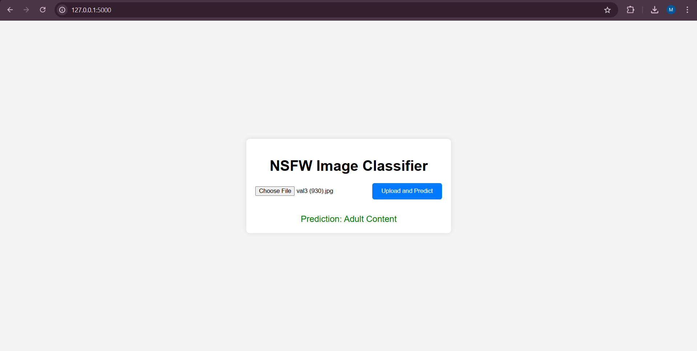

---

# Adult image Classification Using Deep Learning

## Overview
This project uses deep learning to classify images as **adult content** or **normal content**. The goal is to develop a model that helps in content moderation, 
online safety, and ensuring a positive user experience across various platforms.

## Features
- **Binary Classification**: Classifies images into two categories: Adult Content and Normal Content.
- **Flask Deployment**: The model is deployed through a Flask web application for ease of use and accessibility.
- **Efficient Preprocessing**: Handles invalid or corrupted image links during training and inference.

## Tech Stack
- **Programming Language**: Python
- **Frameworks & Libraries**:
  - Flask: Web application framework
  - TensorFlow/Keras: Deep learning model for classification
- **Dataset**: Custom datasets containing labeled adult and normal content images.
## Dataset
The dataset used for training the model can be downloaded from [Google Drive](https://drive.google.com/drive/folders/1uY0FXh8dn4QBMK_g0-cgqASodXwc6Q_R?usp=drive_link).
Alternatively, you can request access to the dataset by contacting the author of the project.


## Installation

1. **Clone the Repository**:
   ```bash
   git clone https://github.com/mohan120105/adult-image-classification.git
   cd adult-image-classification
   ```

2. **Install Dependencies**:
   ```bash
   pip install -r requirements.txt
   ```
   

3. **Download the Model**:
   The `nsfw_classifier.h5` file is hosted on cloud storage. You can download it from [Google Drive]((https://drive.google.com/file/d/1n3-mQzW4urQW-xypoNgky6bjy33NXeTp/view?usp=sharing)) or another platform. 
   
   - Use the following Python code to download the model dynamically:
   ```python
   import gdown

   def download_model():
       url = "(https://drive.google.com/file/d/1n3-mQzW4urQW-xypoNgky6bjy33NXeTp/view?usp=sharing)"
       gdown.download(url, "nsfw_classifier.h5", quiet=False)
   ```


## Usage

### Running the Flask App Locally
1. **Start the Flask App**:
   ```bash
   python adult_app.py
   ```

2. **Access the Web Interface**:
   Open your browser and navigate to `http://127.0.0.1:5000` to upload images and get classifications.

### Model Training
1. **Prepare Dataset**:
   Organize the dataset into `train`, `validation`, and `test` directories with subfolders for each class (adult, normal).

2. **Train the Model**:
   ```bash
   python train.py
   ```

3. **Evaluate the Model**:
   ```bash
   python evaluate.py
   ```

### Loading the Model
When the Flask app starts, the model will be loaded either from the local directory or downloaded dynamically from cloud storage if not already present.

```python
def load_model():
    try:
        model = tf.keras.models.load_model("nsfw_classifier.h5")
    except:
        print("Downloading model...")
        download_model()
        model = tf.keras.models.load_model("nsfw_classifier.h5")
    return model
```

## Results
- **Accuracy**: Achieved **94% accuracy** on the validation dataset.
- **Loss**: Training and validation loss curves show good model convergence with minimal overfitting.

## Screenshots



## Future Scope
- Extend the model for multi-class classification (e.g., different categories of adult content).
- Implement real-time image classification with a live camera feed.
- Expand the system to include video classification.

## Contributing
Contributions are welcome! Feel free to fork the repository, raise an issue, or submit a pull request for improvements.

## Acknowledgments
- [TensorFlow/Keras Documentation](https://www.tensorflow.org/)
- [Flask Documentation](https://flask.palletsprojects.com/)

---
